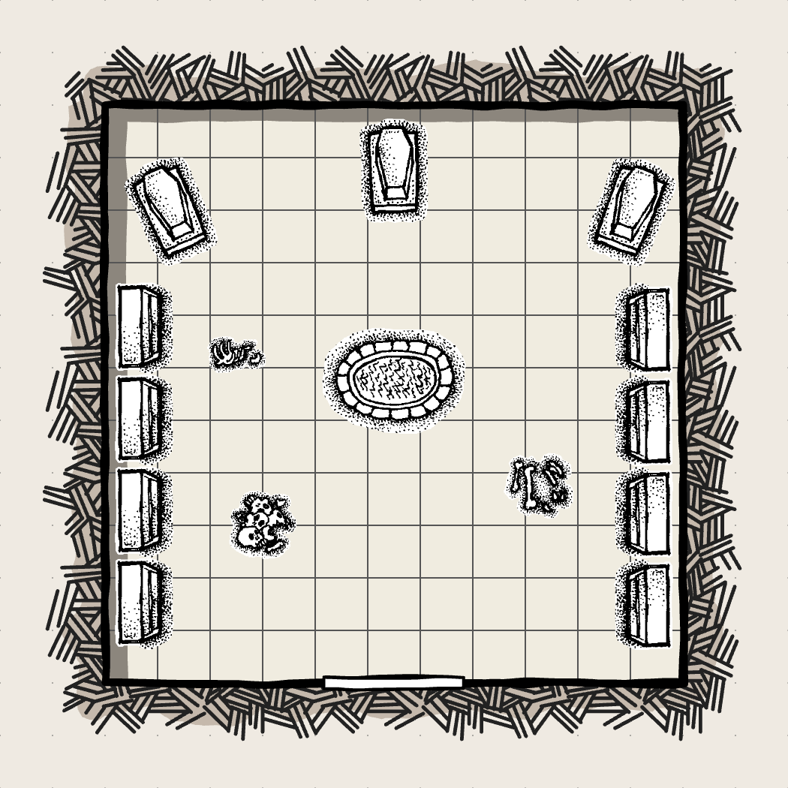

# The Forgotten Church Of Oghram
Tucked far away in the Emerald Wastes lay what is left of the Temple of Oghram. A once holy place now lays broken and reclaimed by the earth like so many other cites in the Emerald Wastes.

index:
*

## Lore
The Church of Oghram was founded by Ellis Greyjoy a man who was almost as wealthy as he was pious. He founded the church with a collections of members from the larger Oghram Church in the kingdom of Kaladrenor. They sought to bring science and reason to the Emerald Wastes. They wanted to categorize its grand majesty into tiny conceivable piece from which to build a larger understanding. For this purpose they built a church compound out of wooden planks transmuted into stone. The church was where they lived, worked, and communed with the divine, and for a time they were happy. But unfortunately for them the Emerald Wastes are hostile to more than just scientific inquiry. Mother nature seeks to snap you up at every turn and if you aren't constantly vigilant she'll catch you like a mouse in the talons of an eagle. That kind of pressure puts a lot of weight on the psyche, and if you aren't willing to trust other you will go mad. Just like Ellis.

Ellis Greyjoy was someone you might describe as a "harsh yet reasonable man". The kind of guy who yells at you not purely out of anger, but also out of love and passion for the subject matter. He has impossible standards for you because he wants you to be the best you can be. We can argue about the merits of his flavor of zealotry all day but there is one thing for certain it isn't conducive to a culture of honesty because people will be to afraid to speak up knowing they will disappoint. And that was exactly what happened. 

One day one of the hunters was going out 

You shouldn't keep your thoughts to yourself.

## The Wilds (Entrance)
On their way through the forest the players will encounter

## A Search For The Entrance (Puzzle)
**Above Ground**
1. Warship Room
2. Watchtower (ruined)
3. Living Quarters
4. Outhouse

## Setback

**Below Ground**
1. Library
2. Crypt
3. research room

## Crypt (Climax)

### Description:
The First thing that hits you is the stench like a wave of force you are 

### Notes:

### Map:

[Final battle Music](https://www.youtube.com/watch?v=DNEam-XyvbE)

## Reward